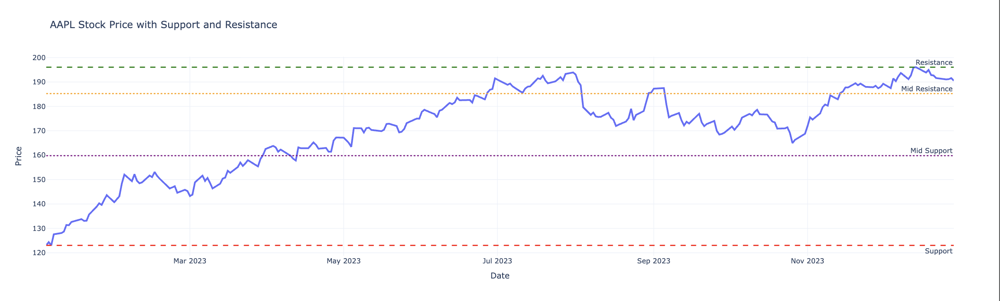

# Nathan Nemali - Portfolio

## About Me
Whitman College, studying Economics with minors in Data Science and Finance. Interested in markets, trading, and data driven decision making.

## Education
Whitman College  
Economics major, Data Science and Finance minor  

## Experience
Aspen Trading  
Worked on CRM systems, lead scoring, and marketing automation. Helped build workflows and improve client segmentation.

Precanto Internship  
Gained experience in business operations and data related tasks in a professional environment.

Bay View Golf Club  
Junior golf coach working with beginners and intermediate players.

## Skills
Data analysis  
Stock trading basics  
CRM tools and automation  

## Athletics
Whitman College Golf Team  

## Final Project Ideas

### 1. Stock Market Patterns
Can combining indicators improve prediction accuracy?

### 2. Golf Performance Data
What factors most influence scoring in competitive rounds?

### 3. Email Marketing and CRM Data
What behaviors make a lead more likely to convert?

### Week 10 Update
I will be completing this project with Daniel Virula.

My general topic is analyzing stock market data using technical indicators. I am interested in understanding how indicators like moving averages and RSI relate to price movements and potential trading signals.

For data sources, I am planning to use Yahoo Finance through the yfinance Python library. One advantage is that it is easy to access and does not require an API key. It also provides a wide range of historical stock data. A downside is that it may not always have the most up to date real time data and has limited built in indicator calculations.

Some questions I am hoping to explore include:
1. How do moving averages relate to changes in stock price over time?
2. Can RSI indicate when a stock is overbought or oversold?
3. Are there patterns in price movement after certain indicator signals occur?

Overall, I want to use these indicators to better understand how traders analyze stocks and how data can be used to make decisions.

## Project Update – Week 11

### Data sources and why
I decided to use stock market data from the Yahoo Finance API. I chose this because I am interested in investing and trading, and it provides real time and historical data like prices, volume, and indicators that are useful for analysis.

### How I acquired the data
I accessed the data using Python and API requests. I used specific stock tickers like AAPL and TSLA to pull historical price data. If I continue, I plan to automate pulling multiple stocks and longer time periods.

### Important considerations
The dataset is strong because it is large and updated frequently. However, it is limited because it does not directly include all technical indicators, so I may need to calculate things like RSI or moving averages myself.

### Preliminary analysis
From my initial exploration, I saw trends in stock prices over time and noticed patterns like volatility and general upward or downward movement. Some stocks showed stronger trends than others.

### Cleaning and wrangling
I had to convert dates into proper datetime format and make sure numerical values like prices were usable. I may also need to handle missing values and create new features like daily returns or indicators.

### Challenges
One challenge was making sure the API requests worked correctly and returned the right data. Another issue is organizing multiple stocks into one clean dataset for analysis.

### Week 12 Update

I added support and resistance levels to the stock price chart to identify key price zones where the stock tends to reverse or slow down. These levels help highlight potential areas of buying and selling pressure, which are important for understanding market behavior. This connects directly to my overall project, since I am focusing on analyzing stock data and building toward trading strategies. By identifying these levels, I can better understand where price movements might stall or reverse, which is useful for making decisions about entry and exit points. Moving forward, I plan to build on this by adding technical indicators like RSI and moving averages to create a more complete view of market conditions and improve how I analyze potential trades.
