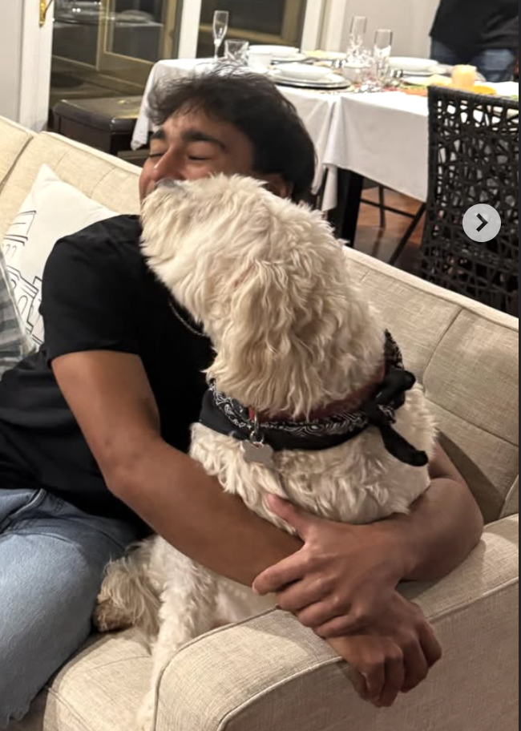

# Nathan Nemali - Portfolio

## About Me
Whitman College student studying Economics with minors in Data Science and Finance. Interested in markets, trading, and data driven decision making.

## Education
Whitman College  
Economics major, Data Science and Finance minor  

## Experience
Aspen Trading  
Worked on CRM systems, lead scoring, and marketing automation. Helped build workflows and improve client segmentation.

Precanto Internship  
Gained experience in business operations and data related tasks in a professional environment.

Bay View Golf Club  
Junior golf coach working with beginners and intermediate players.

## Skills
Python  
Data analysis  
Stock trading basics  
CRM tools and automation  

## Athletics
Whitman College Golf Team  
Conference champion and competitive tournament player
